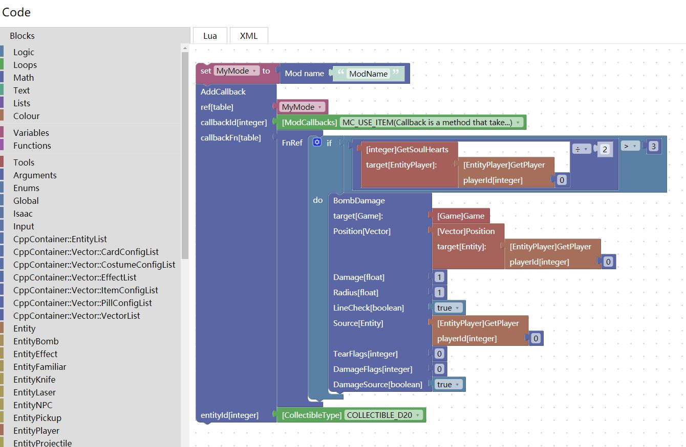

# 使用Blockly图形化编程创建游戏《以撒的结合》mod

这个工程允许你使用Google Blockly图形化编程语言来创建游戏的mod。你可以在[点击此处](http://frto027.gitee.io/blocklyisaac/?lang=zh-hans)进行试用。

游戏的接口定义在`game_blocks.js`文件中，该文件通过`CodeGenerator\class_parser.py`识别LuaDocs的doxygen文档自动生成。

# 翻译说明

除了枚举量和各种道具、敌人的名字之外，中文的翻译接近完成。但在使用过程中可能会遇到一些奇怪的东西，这里解释一下。

api中充斥着大量的缩写、略写、重复单词。为提高翻译效率，我将相同的语句提取出来，类型单独提取并翻译，尽管如此还是有将近4000行的文本需要翻译。这种做法会导致少部分翻译出现问题，为此生成脚本中专门设置了`translate_no_dup_texts`变量用来禁止某些词汇被重复使用。  
每条翻译都是人工填写的，部分不确定含义的api没有翻译。  
使用过程中可能会见到一些奇怪的翻译，这大概率是由于以撒程序员懒散的缩写无法结合上下文导致的。  

那么下面举两个例子。
> 有一个参数的名字叫做`r`，通常表示红色（`red`），但也有可能会表示`右值`(`right value`)等概念。

> 再举例一个奇葩，`ro`的意思是`red offset`表示`红色偏移`，但它在习惯上解释为`read only`表示`只读`。

由于解决这些问题需要逐条确认各个模块，且会引入大量的不可复用翻译，工作量巨大。目前的版本不处理这些情况，这个问题（不一定）会在之后逐条确认解决。

# 回调流程翻译

回调参考文件为[IsaacDocs文档](https://moddingofisaac.com/docs/rep/images/infographics/Isaac%20Callbacks.svg)。

`CodeGenerator/callback_gen.js`是根据code_translate中的js文件自动翻译此文档中MC开头字符的自动化脚本。

翻译好的文档位于`media/callbacks`目录下。

# 帮助说明

右键一个块，点击帮助，就可以打开对应的IsaacDocs英文文档。

如果右键枚举变量`Mod回调`，还能看到一份翻译过的回调图。

# `Help` button and IsaacDocs

You will be redirected to IsaacDocs webpage if you right-click blocks and press the `Help` button.  

# BlocklyIsaac
Create script for game The Binding of Isaac without lua.

[Try it at git page](https://frto027.github.io/BlocklyIsaac/)

[Try it at gitee page](http://frto027.gitee.io/blocklyisaac/)

You can create script like:



Then you can get the following script by clicking on the Lua tab.

```lua
MyMode = RegisterMod('ModName',1)
Isaac.AddCallback(MyMode,ModCallbacks.MC_USE_ITEM,function(__arg_0,__arg_1,__arg_2)
  if (Isaac.GetPlayer(0)):GetSoulHearts() / 2 > 3 then
    (Game()):BombDamage((Isaac.GetPlayer(0)).Position,1,1,true,Isaac.GetPlayer(0),0,0,true)
  end
end ,CollectibleType.COLLECTIBLE_D20)
```

# How to build

the project is already built, you can click `index.html` to run directly.

However, if you want to build it yourself, you can run the folowing command with `python 3`.

> Please make sure that the git submodule `IsaacDoc` has been initialized before building. The API and translation files are automatically generated based on the doxygen documentation in that project.

```
git clone https://github.com/frto027/BlocklyIsaac.git
cd BlocklyIsaac
git submodule init
git submodule update
python -m pip install bs4

python ./CodeGenerator/class_parser.py
```

the `node.js` project is under development. Try it as follows.
```
npm install
npm start
```

build the electron exe as follows.
```
npm run build
```

# Translate it to your language

1. Uncomment the `Code.LANGUAGE_NAME` variable in the `code.js`.
2. Add an item to the `translate_files` variable in `CodeGenerator/class_parser.py`
3. Rebuild project.
4. Edit your language config at `code_translate` directory.

# Special thanks

I used the [Blockly](https://developers.google.com/blockly) as the front-end language.

The [IsaacDocs](https://github.com/wofsauge/IsaacDocs) project helped me solve a lot of problems, and it was also the input source for automatic scripts written with [Python](https://www.python.org/).

[NodeJs](https://nodejs.org/) and [electron](https://www.electronjs.org/) provide native execution support.

Icons from the [Material Design](https://material.io/).

And the game [The Binding of Isaac: Afterbirth+](https://store.steampowered.com/app/570660/The_Binding_of_Isaac_Afterbirth/)
