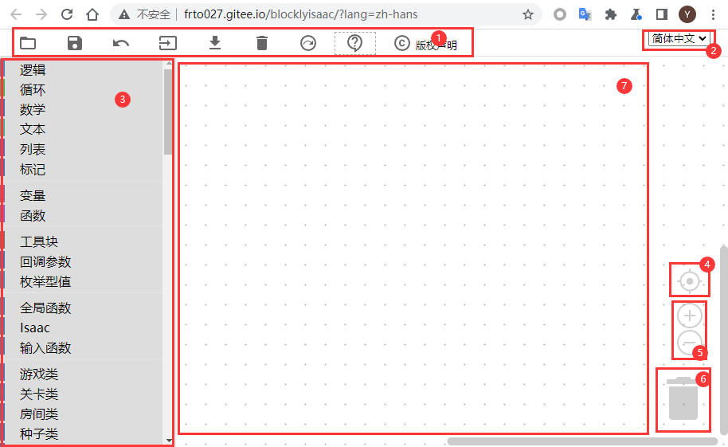
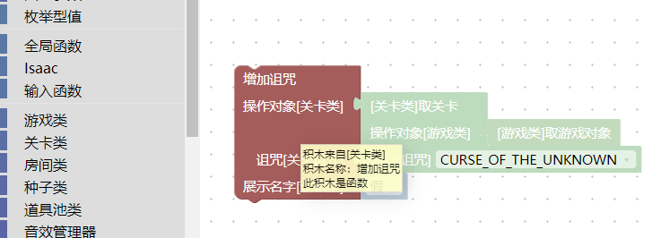
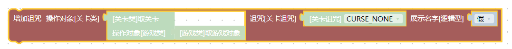
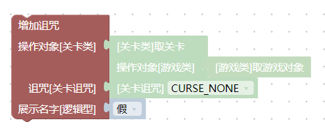
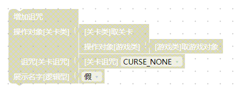
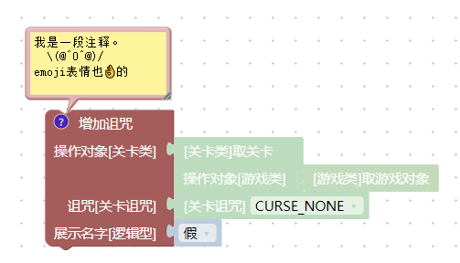

# 基本操作

基本的编辑器界面主要由以下部件构成：

  

1. 工具栏，从左到右依次为
    - `打开`按钮，可以打开`biml工程文件`
    - `保存`按钮，可以将当前的积木内容保存为`biml工程文件`
    - `撤销`按钮，也可以按`ctrl+z`来撤销，还可以按`ctrl+shift+z`来重做，也就是“撤销`撤销`”
    - `复制到游戏控制台`按钮，点击后可以根据`积木程序`来生成一条控制台指令，在游戏的控制台上按`ctrl+v`即可执行。是一种方便的执行逻辑的方式。
    - `导出lua程序`按钮，可以将`积木程序`导出为`main.lua`文件，此文件可放在mod中生效。
    - `清空`按钮，清空当前的所有积木。
    - `下载离线版本`按钮，点击后跳转到离线版本程序的网站，此按钮在离线编辑器中不存在。
    - `打开教程文档`按钮，点击后打开此文档的主页
    - `版权声明`按钮，编辑器的版权为`MIT License`开源许可。
2. 语言选项，在这里可以切换语言
    - 目前只有中文在持续维护
3. 工具箱，所有的`积木`都可以在这里找到
4. 缩放重置按钮，点击后，所有的积木回到视野正中心。
5. 缩放按钮
6. 删除按钮，将不需要的`积木`拖拽到这里删除，也可以右键删除一个积木，或选中一个块后按键盘的`del`键
7. 工作区，在这里摆放积木

# biml工程文件

可以将已经搭建好的积木保存为`biml`工程文件。`biml`是`BlocklyIsaac XML`中的部分字母的缩写，是一种以文本方式保存的xml文件格式，保存了各个`积木`的定义及其连接方式等内容。

# 悬停提示

将鼠标放在一个`积木`上保持不动，就会显示一个悬停提示。

  

对于以撒的游戏内逻辑积木，此提示目前包括：

- 积木的来源，例如图上的积木就来自左侧的`关卡类`中。这在阅读别人的程序，想要快速找到`积木`来源的时候会有帮助。
- 积木的名称，对应的是积木的功能。例如图上的积木就是一个`增加诅咒`的功能。
- 积木的类型，对应有变量、函数等形式。不同类型的`积木`生成的`lua代码`是不一样的，一般无需关心这个类型。

# 右键菜单功能

当我们右键一个`积木`的时候，会弹出一个菜单：

  

1. `克隆`，再复制一个一模一样的`积木`，可以使用快捷键`ctrl+c`然后马上按`ctrl+v`来实现。
    - 受限于程序接口，网页版本的在线编辑器不支持跨页面的复制粘贴。也就是如果同时打开两个编辑器的话，在其中一个编辑器中复制的内容，无法粘贴到另一个编辑器中，因此右键菜单不单独提供`复制` `粘贴`选项。如果下载可执行的本地离线版本，则没有此限制。
2. `添加注释`，给`积木`写一段标注文字，这段文字没有实际作用，是给人看的。
3. `单行输入`，切换到`单行输入模式`。
4. `折叠块`，将`积木`折叠起来，不会影响到原本功能，但看着会更省地方。
5. `禁用块`，这会导致当前的积木完全失效。
6. `删除x个块`，删除`积木`。
7. `帮助`，跳转到相关的帮助文档。对于`Blockly`内置的`积木`，将跳转到对应逻辑的维基百科或其它相关页面。对于`以撒的结合`游戏中的功能积木，将跳转到[IsaacDoc](https://moddingofisaac.com/docs/rep/index.html)文档，此文档为lua编程时使用的文档，与`以撒的积木`工程中的积木块是严格对应的。
    - IsaacDoc文档由开源社区维护，记录了游戏的各个模块的使用方式、bug等。个别`积木`由于BUG无法使用，则可能会记录在此文档中。
8. 其它，个别积木会有其它特殊的选项。

# 单行输入模式

右键菜单中的`单行输入`模式会让一个`积木`的所有输入嵌入进来，和原本的`外部输入`模式在功能上完全相同，但可以方便摆放。

单行输入模式：

  

外部输入模式：

  

# 折叠块

右键菜单中的`折叠块`会让块缩小，来方便摆放：

  

# 禁用块

禁用一个块之后，这个块的功能就会失效，就好像它被删除了一样。但可以通过右键再次启用：

  

# 注释

右键一个块可以`添加注释`，这会在块的左上角标记一个问号，点击这个问号之后，会跳出一个文本框，文本框的内容可以随意编辑，并随着`biml工程文件`保存和加载。

**`注释`是一个重要的交流工具，你可以在一个`积木`上添加注释，告诉别人你在做什么。或者防止自己下次看到以后忘记自己做过什么。**

  
