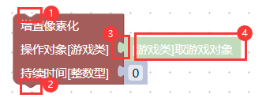
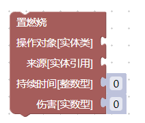
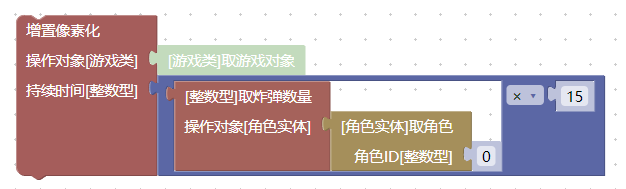
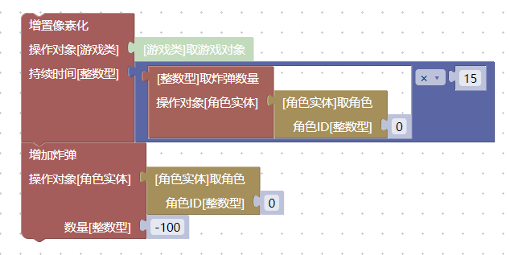
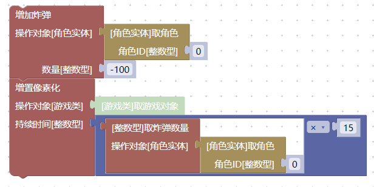

# 积木搭建规则

此文介绍基本的积木搭建规则。

工具箱中提供了各类积木，可以实现各种功能。

## 填充正确的积木输入

比如我们在`游戏类`中，拿出一个`增置像素化`的积木：

  

其中，`1`、`2`、`3`可以用来连接其它积木，`4`是一个浅色的`影子积木`。
如果要让一个积木正常工作，需要让积木上的每一个`3`这样的输入凹槽都填充正确的值。

像下面这样的积木，它缺少了`操作对象`和`来源`两个参数，是不能直接执行的：

  

如果想要执行这个积木，需要正确填充两个缺少的参数。这需要其它的逻辑配合实现，比如`距离角色最近的Gaper`、`与子弹发生碰撞的实体`、`受到xxx伤害的实体`等。这些逻辑会在之后的教程中介绍。

## 影子积木

在更新新版本之后，很多的积木输入上附带了浅色的`影子积木`，作为默认值使用，可以方便积木的搭建。比如此图中的`4`就是一个影子积木，下面的`持续时间`的输入数字0也是一个影子积木：

  

我们可以把`影子积木`替换为任意一个自己想要的值，比如下面的这段程序中，像素化的时间就和角色的炸弹数量挂钩：

  

你可以在游戏控制台中输入`spawn 5.40.1`生成炸弹。然后点击前面的`#打开编辑器`按钮快速打开这个工程，再点击复制到游戏控制台按钮，在游戏内打开控制台，按`ctrl+v`粘贴执行指令，按`回车键`执行。

在这个教程中，如果想要保存工程文件，请右键`#保存工程文件`，并选择`链接另存为`或类似选项。

可以观察到，这条指令执行后，角色在具有1颗炸弹和4颗炸弹时，游戏像素化的时间是有明显差别的。它将炸弹数量乘15，然后作为持续时间。换句话说，角色每拥有一颗炸弹，都会获得15帧的像素化效果。

## 积木的执行顺序

此图中的`1`、`2`两个位置连接其它积木，所有的积木是从上向下顺序执行的。

  

比如，我们可以在刚刚的指令结束之后，增加`-100`个炸弹，也就是扣除`100`个炸弹：

  

执行上面的程序，可以发现在像素化之后，角色的炸弹数量清零了。因为是先计算持续时间，然后才扣除炸弹数量。

但是如果将两个积木上下反过来拼接，则永远都不会有像素化效果，因为像素化指令看到的是已经扣除过的炸弹数量：

  

### 延迟执行的误区

积木不存在延迟执行，也不可能有*从上向下连接*的`等待xxx秒`的积木。实际上，从刚刚的程序就可以看出来：

  

你可能会认为，这个程序的炸弹扣除操作应该发生在像素化结束之后。但实际上，在像素化开始的时候，炸弹就已经扣除了。

这是因为，**程序的执行都是瞬间完成的**。我们的程序不会连续执行2秒钟。从控制台输入的指令，会**立即执行完毕**,然后回到游戏正常的渲染逻辑中。`增置像素化`在游戏内部做的，是给一个`像素化`的内部状态做一个标记，然后马上就去做下一个`增加炸弹`的操作了，后续的像素化操作是通过游戏其它内部逻辑实现的。当然，我们可以通过其它的手段实现`两秒钟后执行另一个积木程序`，来达到类似延迟的效果，之后的教程会介绍。