# 类型系统

类型用方框表示，用来指示一个参数的含义。每一个积木产生的信息都有对应的类型。如果一个积木产生的值类型和一个输入的类型不匹配，那么就不能够正常连接起来。

内置的一些类型有：

- `整数型`、`实数型`，二者不做特殊区分。表示这个参数是一个数字。比如游戏走过的总时间、当前的血量、炸弹数量等。
- `字符串`，表示一串文字。比如道具名字、道具描述、游戏种子名字、或者一条控制台指令的内容等。
- `逻辑型`，表示对错、真假等数据。比如是否拥有某个道具、当前房间是否在Boss房间、是否可以飞行等。
- `复合数据`，游戏的lua文档没有详细记录的东西。编辑器不知道该如何处理它。一般这种值在不同情况下有不同的处理方法。有些需要等待编辑器后续更新才能使用，也有一些可能会使得游戏崩溃。

此外，工具箱中涉及到游戏逻辑的每一个项目多数都对应一个类型，是按照操作对象进行划分的：

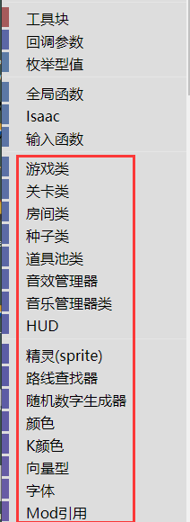  

另外，还有一种类型为`空值`的类型需要留意。

# 枚举型值

枚举型值是一类特殊的值，一般表示从多个值之间进行一个选择。

比如有一个`主动道具槽位`类型的枚举型值，它可以表示角色主动道具的位置：

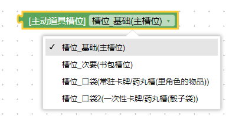  

在`清零主动道具充能`的积木上，就用到了这个`枚举型值`作为输入，以指定清零哪里的道具：

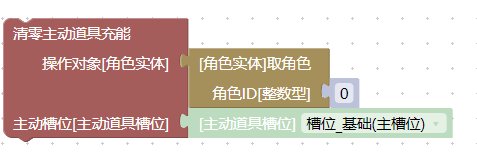  

# 类型匹配

输入和输出类型需要匹配。

下图中，`1`表示`逃离目标`的操作对象需要是一个`路线查找器`类型，而`2`表示积木`3`得到的是一个`路线查找器`。`1`和`2`一致，所以才能够拼接起来：

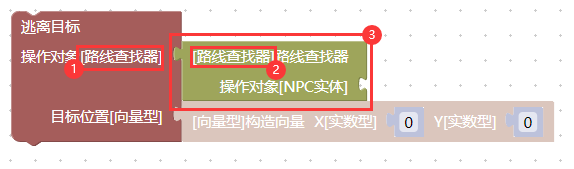  

# 类型继承

先看一个例子。`取角色`的积木可以得到一个`角色实体`，对角色实体，可以`增加黑心`：

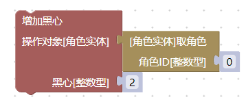  

## 向下转型操作

`炸弹实体`、`角色实体`、`效果实体`、`跟班实体`、`刀实体`、`激光实体`、`NPC实体`、`拾取物实体`、`子弹实体`、`眼泪实体`都是`实体类`，所有对`实体类`的操作，都可以对这些类型进行。

`实体类`中，我们还可以让一个`实体类`死亡，这里的逻辑是，`炸弹实体`、`角色实体`、`效果实体`、`跟班实体`、`刀实体`、`激光实体`、`NPC实体`、`拾取物实体`、`子弹实体`、`眼泪实体`都可以死亡，因此可以按照以下方式拼接：

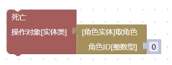  

但是，反过来就不行了，如果我们用`生成`指令生成一个实体，它无论如何都不能进行增加黑心。因为`实体类`不是`玩家实体`，所以这里是拼不上去的：

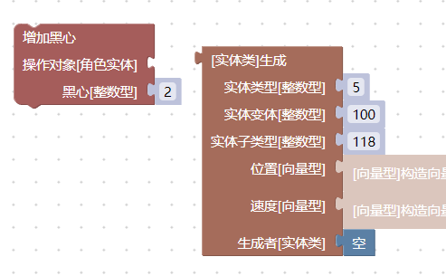  

## 向上转型操作

有时候，我们想要生成一个底座道具，然后设置它的价格（`生成`块类似控制台指令`spawn 5.100.118`）：

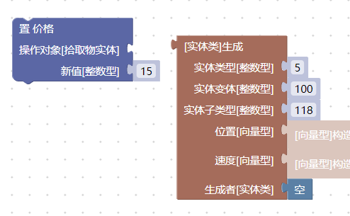  

由于`生成`积木块能够生成游戏中的任意实体，它不知道自己生成的到底是一个`可拾取物`还是一个`NPC实体`(也就是敌人)，也有可能是`炸弹实体`等，所以它笼统地给出一个`实体类`。

但在这里，我们很确定生成的就是道具底座，所以使用一个`到拾取物`来连接两个积木（也就是`向上转型`）：

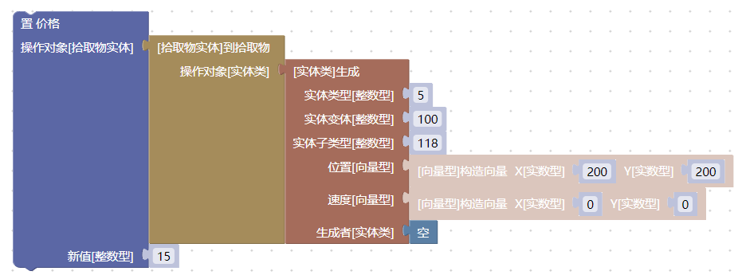  

由于道具价格受到其它的自动更新机制影响，我们暂时没办法设置为15之外的值，这一点先不用关心。

`实体类`中为我们提供了各种类型的转换积木：

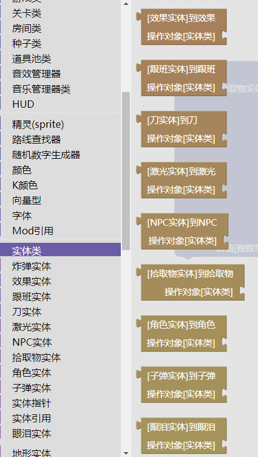  

如果要使用这些积木，需要在逻辑上确保操作对象是正确的类型，否则会产生一个`空值`。

对`空值`进行操作可能会导致脚本执行错误。这一类错误并不会破坏游戏的mod系统，也没有什么严重的后果，但会让当前正在执行的mod程序逻辑中断。如果你的代码是在其它位置（而非控制台上，比如在角色受伤后）执行的，游戏可能会禁止掉你的mod，或者导致后续其它mod的逻辑无法执行等。

## 继承关系

以撒的mod系统继承关系非常简洁，共有两类继承关系：

`炸弹实体`、`角色实体`、`效果实体`、`跟班实体`、`刀实体`、`激光实体`、`NPC实体`、`拾取物实体`、`子弹实体`、`眼泪实体`都是`实体类`。

`地形实体_门`、`地形实体_沟壑`、`地形实体_大便`、`地形实体_按钮`、`地形实体_石头`、`地形实体_尖刺`、`地形实体_爆桶`都是`地形实体`。

# 空值

在`逻辑`中有一个积木可以产生空值：

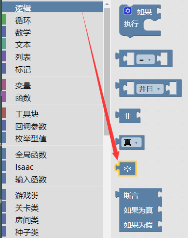  

空值可以出现在几乎任何地方，对空值进行操作可能会出现问题，这需要视情况而定。

比如，在前面的`生成`操作中，`生成者`就可以是`空值`：

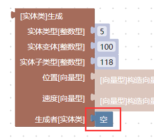  

但是我们不可以给`空值`增加一颗黑心，这会导致语法错误：

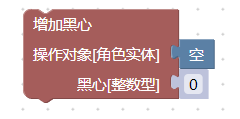  

在其它情况下，`空值`可能会进入到具体的游戏内部逻辑，多数情况下游戏可能会正确处理，少数情况下也可能会导致崩溃。

什么时候使用`空值`需要根据具体积木的游戏内部实现逻辑来确定。

