# 逻辑积木

我们来介绍`逻辑`相关的积木：

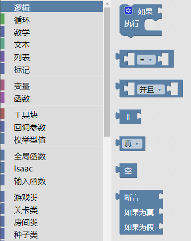  

## 逻辑型

逻辑型只有两个值：`真`和`假`。

## `如果`积木

`如果`积木右侧有两个凹槽，第一个凹槽多数情况下放置的是`逻辑型`的值，如果是`真`，就会执行`执行`里面的积木。不论真假，都会继续执行下面的积木。

例如，下面的程序表示，如果角色是满红心的，就播放开心动画。不论角色是否满红心，都增加一颗炸弹：

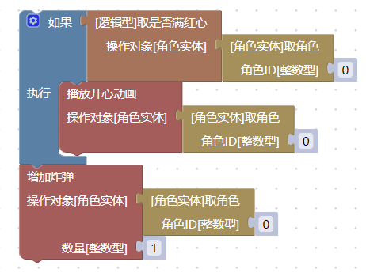  

`如果`积木还可以设置其它的形式。点击左上角的设置按钮，你可以设置多个条件和逻辑：

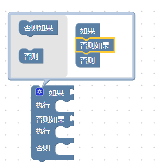  

比如我们给前面的逻辑增加一个悲伤动画。如果角色满红心，就播放开心动画，否则播放悲伤动画。不论是否满红心，都增加一颗炸弹：

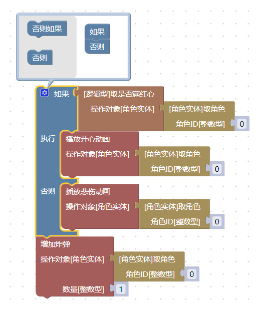  

## `比较`积木

`比较`积木可以比较两个数字，得到的是逻辑型：

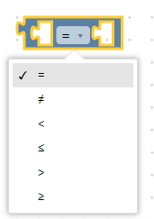  

比如，下面的指令实现，当角色的`炸弹数量`大于`5`，就播放开心动画：

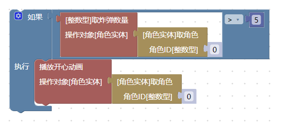  

## `逻辑运算`积木

逻辑运算积木的两个输入通常是`逻辑型`。

`并且`表示左右同时为`真`，才能得到`真`。`或`表示左右有一个为`真`，就能得到`真`。

例如，下面的程序需要`炸弹数量`和`金币数量`都大于5，才会播放开心动画：

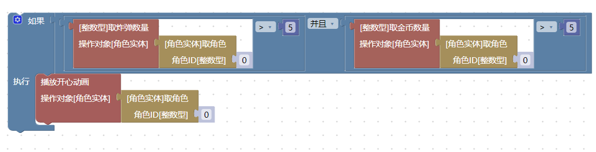  

而下面的程序只要有任意一个大于5，就会播放开心动画：

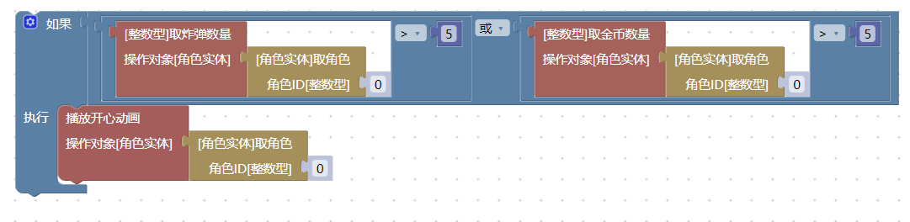  

## `非`积木

`非`翻转一个逻辑值，`非真`为`假`，`非假`为`真`。

例如，如果不满红心，就播放悲伤动画：

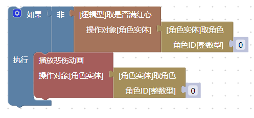  

## `真假`积木

这个积木直接产生一个`真`或者`假`:

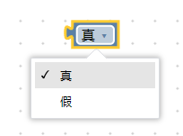  

例如，这里一定会执行`播放悲伤动画`：

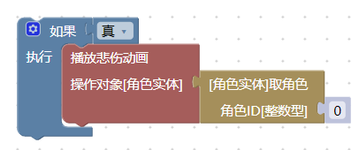  

再比如，`移除道具`的积木中，使用它来表示是否连带套装效果一起移除（此处为`影子积木`，因此可以替换为其它逻辑）：

  

## `空值`积木

它产生一个`空值`，`空值`在特定的逻辑中被用到，详见[类型系统#空值](3.type_system.md#_8)

## `断言`积木

`断言`积木接受三个参数，第一个参数一般是`逻辑型`。第一个参数为`真`的时候，它输出第二个参数，否则输出第三个参数。

例如，下面的程序实现，如果角色满红心，就增加单位为4的黑心（2颗），否则增加单位为1的黑心（半颗）：

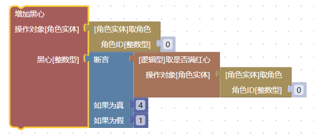  

