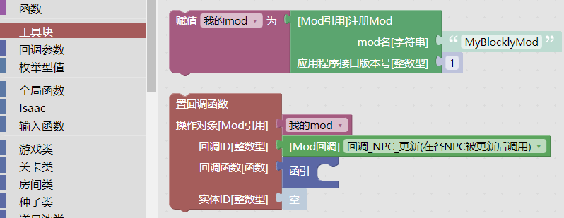
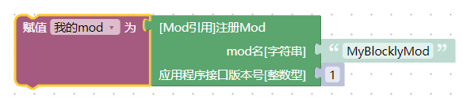
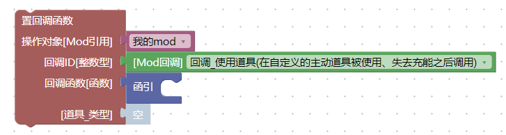
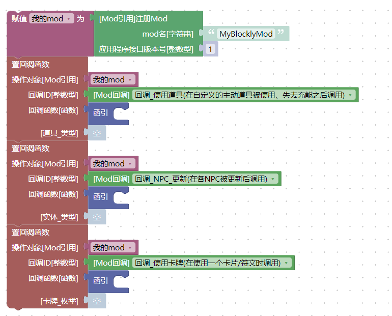
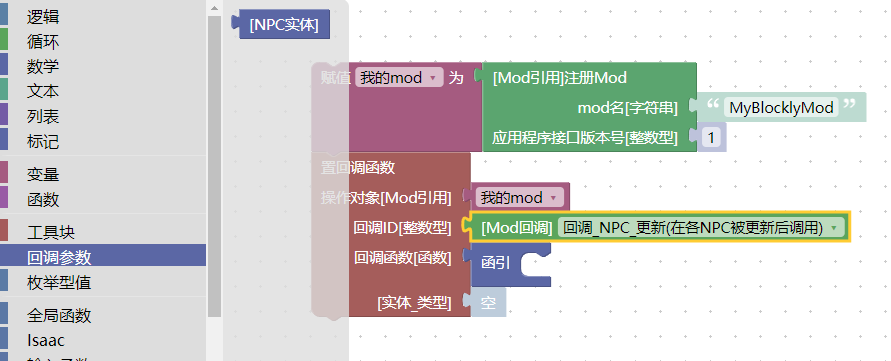
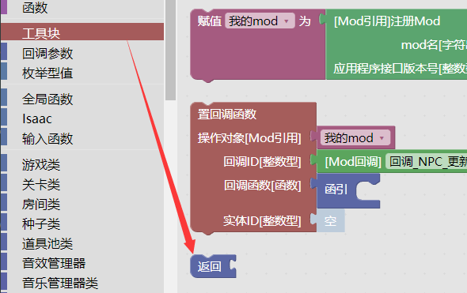
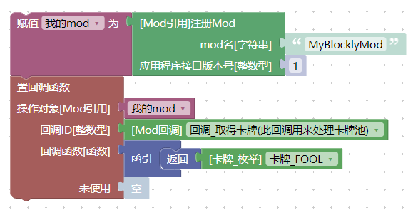
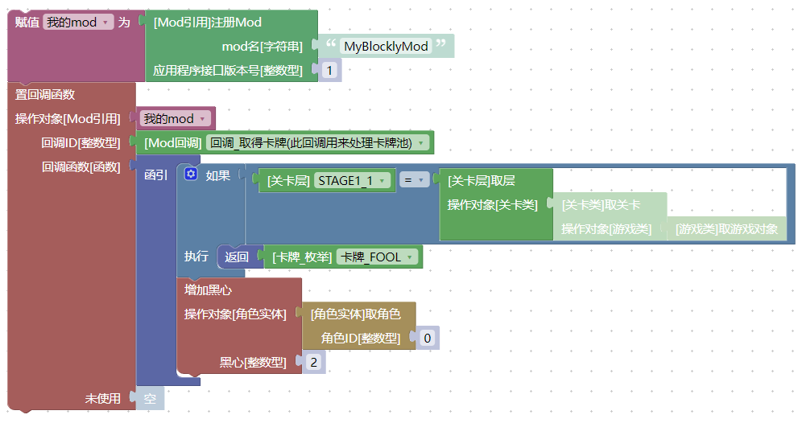

# 游戏流程与`回调`积木

回调积木用来告知游戏在特定的时刻执行某一段程序。

!!! 游戏的运行机制
    在大多数情况下，游戏的核心逻辑以[单线程](https://baike.baidu.com/item/%E5%8D%95%E7%BA%BF%E7%A8%8B/6972534?fr=aladdin)的方式在运作。这也就是说，游戏在同一时刻只会做一件事情。
    如果感兴趣的话，我们可以通过这张<a href="../../../../../media/callbacks/Callbacks_zh-hans.svg">回调图</a>来了解游戏的一个大致运行流程（该图片译自[IsaacDoc](https://moddingofisaac.com/docs/rep/images/infographics/Isaac%20Callbacks.svg)文档）。

# 注册一个`回调`

我们可以通过`注册回调`的方式来告知游戏在某一时刻执行一段程序，同时还可以得到一些在这一时刻的相关游戏信息，以及向游戏提供一些信息来决定游戏的行为。

`工具块`中，提供了两个预先搭建好的积木，用来帮助我们注册回调：

  

## 注册一个mod

工具块中的`注册Mod`积木告知游戏我们当前的mod名字。只有先放置这个积木，才能够去注册回调函数，完成后续操作。

  

它有两个参数：

- `mod名`告知游戏我们的mod名字是什么。为了避免bug，尽量不要用中文名字。
- `应用程序接口版本号`写1就可以，可不用关心细节。

!!! 应用程序接口版本号
    `应用程序接口版本号`指的是游戏的mod系统接口的版本号，这个参数是用来做兼容支持的。换句话说，这里的数字表示我们的mod是写给哪一个版本的游戏的，目前只有1，不要填写其它数字。我原本以为忏悔的mod会把这个数字改成2的，这样游戏就能通过这个数字来区分mod适用的游戏版本，但官方并没有这样做，这就表示，官方认为`忏悔`的mod和`胎衣+`的mod在行为上没有不同，即游戏不会去主动兼容mod（而是反过来，mod需要去判断游戏的版本来兼容游戏）。

不论后续有多少个回调参数，一个mod**只应该出现一个`注册Mod`的积木，且这个积木只应该被执行一次**。出现多个`注册Mod`或许也没有问题，但这不符合编程规范，有概率出现意想不到的Bug，不要这样做。

我们可以看到，它将一个`Mod引用`放到了一个叫做`我的mod`的`变量`上。关于`变量`的使用会在之后做介绍。

此外`Mod引用`还承担了mod数据存储的功能，这部分目前还没有做测试，相关使用方式会在后续过程中完善。

## 注册一个回调

我们可以在注册mod之后来设置回调函数。也就是使用`置回调函数`积木：

  

这个积木需要三个或者四个参数。

- `操作对象`，就是我们之前注册的那一个mod，默认已经写好了，这里不用关心。
- `回调ID`，就是我们要在什么时候执行程序
- `回调函数`，就是要执行的那一个程序
- `第四个参数`，这个参数的类型和名字会随着`回调ID`来变化，含义也不一样

## 注册多个回调

可以通过多次摆放`置回调函数`积木来注册多个回调，这也是大多数mod做的事情。

  

*请测试你的回调是否能够正常工作，比如因为游戏设计上的BUG，有些回调每个mod只能设置一次，有些回调一个mod设置了，另一个mod就无法再设置*

## 回调参数

回调参数表示游戏在执行这个回调的时候，为我们提供的一些附加信息，当我们选中一个`置回调函数`的积木的时候，左侧的工具箱里就会出现对应的回调参数：

  

比如，上面的`NPC实体`就表示触发`回调_NPC_更新`的那一个`NPC实体`。

## `返回`积木

我们可以使用`返回`积木来告知游戏一些特殊信息：

  

比如，`取得卡牌`的回调不但能让我们在游戏获取一张卡牌的时候执行一段程序，还可以改变游戏取得的卡牌的结果。下面的程序会将所有的`取得卡牌`的结果替换为`卡牌_FOOL`，也就是`The Fool`卡牌：

  

执行后，可以看到，游戏中只会生成`The Fool`卡牌（输入控制台指令`spawn 5.300`试试看吧）。

此外，`返回`积木会让当前正在执行的mod逻辑终止（就像它的形状那样，它的后面不能跟任何的积木）。

!!! info "“返回”积木终止掉的是整个“函引”积木"

    `返回`终止掉的是整个`函引`积木的执行，所以下面的程序在第一层的时候并不会给角色增加黑心——因为一旦触发了`如果`的条件，导致`返回`被执行，那么整个`函引`都会直接中断，后续的`增加黑心`也就不会正常执行了：

      

    

    上面的程序的效果是：在第一层，将所有的卡牌替换为`The Fool`，否则（在其它层），每生成一张卡牌，就给角色增加一颗黑心。

# 回调列表

下面详细介绍每一种回调的使用方式。

（先照搬IsaacDoc，重要得到例子之后会补充的）

## 回调_NPC_更新

在任意NPC更新之后会触发。

使用`返回`积木返回任意的值，都不会影响到后续的回调执行。

!!! Warning "警告"
    当NPC正在播放`Appear`动画的时候不会触发。例如，在生成`Gaper`时，会在第1帧和第31帧及以后的帧触发。

## 回调_触发更新

在每次游戏更新的时候触发。

使用`返回`积木返回任意的值，都不会影响到后续的回调执行。

这个回调每秒触发30次，在游戏暂停时不会触发（比如弹出暂停菜单）。

## 回调_触发渲染

在每次游戏渲染时触发（每秒60次）。

使用`返回`积木返回任意的值，都不会影响到后续的回调执行。

强烈建议只用来做渲染。不推荐使用它来做一些低频事件或者刷新数值。

## 回调_使用道具

当使用自定义主动、失去充能后触发。

道具的`随机数字生成器`可以用作事件种子。  
使用`返回`积木返回一个`真`，就会播放“使用道具”动画，返回一个`假`，不会播放动画。  
使用`返回`积木返回一个任意的值，都不会影响到后续的回调执行。

如果返回一个复合数据，还可以指定更多的结果（暂不支持）。

## 回调_触发角色效果更新

每一帧、每一个角色在计算完毕固定的道具效果后会触发。

使用`返回`积木返回一个任意的值，都不会影响到后续的回调执行。

## 回调_使用卡牌

当使用卡牌/符文时触发。

使用`返回`积木返回一个任意的值，都不会影响到后续的回调执行。

## 回调_跟班_更新

每一帧、每一个跟班都会触发。

使用`返回`积木返回一个任意的值，都不会影响到后续的回调执行。

## 回调_跟班初始化

当一个`跟班`刚刚初始化时调用。

使用`返回`积木返回一个任意的值，都不会影响到后续的回调执行。

!!! Warning "警告"
    被初始化的实体的数据是不完整的。只有`位置`、`速度`、`生产者种类`、`生产者变体`、`生产者实体`等是可用的。一些其他属性（比如`效果属性`或者`眼泪标记`）还没有设置。如果你想要修改这些值，请使用`回调_触发角色效果更新`然后在可用的第一帧检查这些属性。

## 回调_计算缓存

当某一角色的状态重新计算时触发，比如捡起一个道具、使用某个药丸或者手动触发某个`角色实体`的`计算道具`积木。

使用`返回`积木返回一个任意的值，都不会影响到后续的回调执行。

提示：使用此回调来根据自定义道具修改角色的状态、跟班、飞行、武器等。道具会通过`items.xml`中的`缓存值`来告知游戏它影响了哪些状态。这个回调需要遵循`缓存标记`正确设置角色的状态。其它道具对角色的状态影响会在此回调触发之前计算。

## 回调_触发角色初始化

在初始化一个`角色实体`的时候触发。

有一个可选的参数，可以用来指定`角色`或者`2P宝宝`（0表示正常`角色`，1表示`2P宝宝`）。

使用`返回`积木返回一个任意的值，都不会影响到后续的回调执行。

警告：被初始化的实体的数据是不完整的。只有`位置`、`速度`、`生产者种类`、`生产者变体`、`生产者实体`等是可用的。一些其他属性（比如`效果属性`或者`眼泪标记`）还没有设置。如果你想要修改这些值，请使用`回调_触发角色效果更新`然后在可用的第一帧检查这些属性。

## 回调_使用药丸

当使用药丸时触发。

使用`返回`积木返回一个任意的值，都不会影响到后续的回调执行。

## 回调_实体受到伤害

当受到新的伤害前触发。

如果实体拥有`DAMAGE_COUNTDOWN`标记，就会在特定的时间内忽略其它的拥有`DAMAGE_COUNTDOWN`标记的命中。

如果此伤害需要结算，使用`返回`积木返回一个`真`，或者不使用返回积木。
如果需要忽略此伤害，使用`返回`积木返回一个`假`。

如果当前的实体是一个`角色实体`，那么`伤害量`就是角色即将受到的半血伤害。否则，`伤害量`表示伤害点数。

!!! Error "Bug"
    如果执行了`返回`积木，后续其它（mod的`回调_实体受到伤害`）的回调就不会触发

## 回调_触发诅咒计算

诅咒是一个标记。在当前关卡应用了诅咒之后触发。使用`返回`积木返回新的诅咒标记。使用`Isaac`中的`按名称取诅咒ID`来取得一个诅咒ID。

如果使用`返回`积木返回一个数字，它会作为后续（其它mod的`回调_触发诅咒计算`）回调的`诅咒类型`来传播。

!!! Error "Bug"
    使用`返回`积木返回一个非数字的值，会导致游戏崩溃。

!!! Warning "警告"
    当有多个mod的时候，最后一个触发的回调会胜出，覆盖掉前面的回调产生的诅咒值。

## 回调_输入行为

当游戏或者游戏实体想要得到一个输入的时候触发。

如果当前的读取操作并不是来源于一个实体的话，`实体类`是`空值`。  
`输入钩子`可以用来判断当前的回调是通过`输入函数`中的`是否动作被触发`、`是否动作被按下`还是`取动作键值`中的哪一个触发的。  
如果你不想要覆盖游戏的输入值，就不要使用`返回`积木。  
如果是`是否动作被触发`或者`是否动作被按下`，就使用`返回`积木返回一个`逻辑型`的值（`真`或者`假`）。如果是`取动作键值`，就返回一个`实数型`的值，范围在`0.0`到`1.0`之间。

使用`返回`积木返回一个任意的值，都不会影响到后续的回调执行。

## 回调_关卡生成器

!!! Error "Bug"
    此回调目前不能正常工作，且永远不会触发。

（这是游戏的Bug，`以撒的积木`工程不背这个锅）

## 回调_触发游戏开始

当开始游戏时触发，`是继续游戏`的参数为`真`表示是从"continue"继续游戏，为`假`表示开始一局新的游戏。

此回调会在`回调_触发新房间`和`回调_触发新关卡`之后调用。

使用`返回`积木返回一个任意的值，都不会影响到后续的回调执行。

## 回调_触发游戏结束

当`游戏结束`画面出现、或者开始播放结局的时候触发。`是否游戏结束`为`真`表示角色死亡游戏结束，为`假`表示游戏胜利触发结局。

使用`返回`积木返回一个任意的值，都不会影响到后续的回调执行。

## 回调_即将游戏结束

当退出一轮游戏的时候触发。参数`需要保存`为`真`表示游戏会创建一个可以继续的存档，为`假`则表示游戏不会创建存档。当触发游戏结局时会触发两次此回调。

使用`返回`积木返回一个任意的值，都不会影响到后续的回调执行。

## 回调_触发新关卡

当传送到新的关卡或者层后触发。  
在`回调_触发新房间`**之后**触发。

使用`返回`积木返回一个任意的值，都不会影响到后续的回调执行。

## 回调_触发新房间

进入任意房间后触发。

使用`返回`积木返回一个任意的值，都不会影响到后续的回调执行。

## 回调_取得卡牌

用来处理“卡牌池”。  
由于所有卡牌的生成概率并非相等，请使用`随机数字生成器`来做出随机选择。  
可以使用三个`逻辑型`的参数来过滤选择的结果。  
如果需要替换掉生成的卡牌，请使用`返回`积木连接一个数字，并填写需要替换的卡牌ID。或者连接`枚举型值` `卡牌_枚举`。

`返回`积木并不会改变后续回调的`卡牌_枚举`参数。

!!! Error "Bug"
    使用`返回`积木返回一个非数字的值会导致游戏崩溃。

!!! Warning "警告"
    最后一个触发的回调会胜出，并覆盖其它回调返回的值。

## 回调_取得shader参数

返回一个包含自定义shader参数的`复合数据`。

当返回一个`复合数据`时，会跳过其它的回调。

## 回调_执行指令

当执行一条控制台指令的时候触发。

参数`指令`是控制台指令的第一个空格前的字符输入。
参数`参数`是指令的其它部分。

!!! important "重要"
    游戏自带的控制台指令（比如`spawn`和`debug`）**不会**触发这个回调。

使用`返回`积木返回一个`字符串`，会将它打印到控制台上。  
使用`返回`积木返回一个任意的值，都不会影响到后续的回调执行。

!!! Error "Bug"
    使用返回积木会导致游戏崩溃。

（剩下的写不动了，等我慢慢更新）